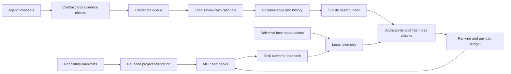

# Project cognition architecture

Version 0.2 implements a local knowledge engine for coding agents. A model authors reusable engineering guidance; DD owns the lifecycle, applicability checks, retrieval cost and provenance. A model's claimed confidence does not establish correctness.

## Data flow

Transports in `src/mcp`, `src/hooks` and `src/ui` call engine services. They do not implement competing admission or retrieval policies. `src/store` owns filesystem publication, indexing and local telemetry. `src/eval` exercises the same retrieval engine.

## Knowledge contract

The required authored fields are `topic_key`, `trigger`, `behavior_delta`, `why` and `evidence_refs`. The type defaults to `lesson`; `decision`, `claim`, `procedure` and `anti_memory` use the same trust boundary. DD derives the title and micro/short/full forms. A small model has one behavioral statement to write rather than several independently maintained summaries.

Optional fields describe applicability (`files`, `components`, `operations`), trigger variants, assumptions, alternatives and revision conditions. Facts are flat typed keys such as `provider.idempotency: true`. Revision rules support file changes, fact changes, dates and manual review. Every compact form retains the conditions needed to interpret the advice.

An omitted fact means unknown, not false. Unknown assumptions remain visible as checks; a known mismatch suppresses the advice. Changed evidence or revision conditions yield a review notice without repeating the potentially stale instruction. Validity windows exclude future or expired guidance.

## Authority and lifecycle

Capture provenance is additive schema-7 metadata. `capture_origin` accepts `model_initiated` or `user_explicit` (default when absent, including historical knowledge). Agents explicitly mark autonomous captures as `model_initiated`; they use `user_explicit` when the user specifically requested saving this knowledge, not merely performing a development task or making a project choice. DD stamps `capture_source` from the transport: `agent` for proposals and `local_ui` for saved UI edits. Agent-provided source stamps are ignored. UI edits create a new `user_explicit` version; review alone preserves the original capture provenance. An agent-reported explicit request or a compatibility default is not authenticated human approval, and neither origin raises authority or ranking.

Missing historical origins read as `user_explicit` by policy; an absent capture channel remains `unknown`. Reading or rebuilding the index does not rewrite Git history or infer origin from authority. A materially changed proposal records its own origin. An equivalent proposal is still deduplicated and returns the original memory with its original capture provenance. `get`, `list`, proposal responses and the audit UI expose these fields; `list` and the UI support origin filtering. Compact retrieval payloads do not include them.

All new knowledge starts as a candidate. The MCP schema excludes generated identity, verified hashes, review stamps, confidence and lifecycle controls. Approval and conflict resolution require the local review transport and a rationale. An agent can flag disagreement and propose revisions, but the advertised MCP tools cannot select a winner or promote a proposal.

Candidates use immutable ID paths, effective decisions use topic paths and history uses ID paths. Proposing a same-topic replacement records the current ID without modifying it. Approval rejects a stale replacement if another reviewed version became current. A successful approval archives the previous version and publishes the new one in a single recoverable transaction.

A replacement inherits unresolved disagreements. Resolving one pair preserves any remaining effective opponents. Historical contradiction relations are retained for audit; retrieval points to effective opponents. No frequency counter raises confidence or authority.

This is an application boundary between model-facing tools and local review. It does not isolate the audit UI or Git files from an agent or user with unrestricted access to the machine. Human review also remains fallible; current repository evidence takes precedence over remembered advice.

## Evidence

File, diff and test-log references must resolve inside the consuming repository, including after symlink resolution. DD computes SHA-256 hashes and limits file reads. It does not execute referenced commands. A host observation can be referenced by its recorded ID and must belong to the same project.

Artifact verification establishes existence and integrity. It does not prove that a test actually passed or that the artifact logically supports the proposed decision. Model-provided `user_approval` references remain unverified claims. The reviewer sees provenance and records the reasoning for accepting the decision.

Verified file evidence and `file_changed` rules are rechecked on recall and expansion. Local host observations expire under retention; their provenance snapshot remains on the decision. Use a durable repository artifact when another checkout needs to inspect the supporting material.

## Project orientation and retrieval

Orientation reads bounded manifest and README content, known script names, root structure and source pointers. It never manufactures architecture from directory names. Reviewed architectural memories add the meaning that manifests cannot supply. This is a source-attributed starting map, not a complete dependency graph or code index.

Retrieval uses FTS candidates plus aliases, authored trigger variants, a small transparent English/Spanish concept vocabulary, and structured file/component/operation cues. It checks scope before ranking and never falls back to arbitrary recent memories after an empty or failed search. The concept vocabulary improves covered phrases; it is not general semantic understanding.

Candidates are ranked by activation, existing evidence authority and recorded use. Knowledge that no retrieval has ever activated ranks below knowledge that has, using the stored use count and age rather than the retrieval log, which the hot path cannot afford to read. A candidate set with no usage history at all carries no evidence either way and is left unranked by that signal. Knowledge that no human reviewed must clear a higher activation floor than reviewed knowledge, because a wrong injection costs more than a missed one.

Selection is not independent per memory. A candidate that repeats a trigger already selected is penalised and an identical one is dropped: a second copy of the same rule spends budget without adding advice. A candidate that contradicts one already selected is excluded outright, so an injected pack never argues with itself; the dispute is surfaced by naming the opponent instead.

Full, short and micro forms are tried in order, with fallback both for size and insufficient value per token. Disputes, unknown assumptions and review notices remain explicit. At most eight memories are returned.

The default budget is 600 estimated tokens for the serialized result. UTF-8 bytes divided by three provides a provider-independent estimate; it is not an exact guarantee for any tokenizer. MCP budgets range from 128 to 8,000. Orientation and recalled knowledge share a budget. Expanded `get` results and tool schemas are separate protocol costs and must be included in real-model measurements.

Delivery deduplication requires an explicit session ID. Its revision includes knowledge state, evidence status, conditions and effective opponents, so a new warning is not suppressed. `repeat: true` refreshes advice after context compaction. Hosts without a session ID still receive bounded retrieval, without cross-call deduplication.

## Persistence and concurrency

Git JSON is the source of truth for knowledge. SQLite uses WAL and contains the rebuildable search index plus local observations, feedback and delivery state. Telemetry is not part of shared project doctrine.

Observations, feedback, retrieval events, admission decisions and session state are bounded by retention. The contradiction log is the exception: it records declared disputes and the rationale a reviewer gave for resolving them, which is audit rather than telemetry, so it is never pruned. A row is written only on an explicit declaration or a human resolution, so it cannot grow the way the observation and retrieval logs do.

A project lock serializes mutations across processes. Nested engine operations reuse that lock. Multi-file changes first persist a roll-forward journal; journal publication is the commit point. Recovery completes it before rebuilding or serving the index. Individual files publish by temporary-file rename after flushing contents. This covers process interruption; filesystem corruption and hardware power-loss behavior still depend on the operating system and storage.

Deletion checks the stored ID and project before removing a topic file. A historical ID cannot delete its successor. Index refresh uses a schema marker and source metadata fingerprint, with filesystem invalidation and periodic refresh for external edits. Metadata fingerprints are cache invalidation, not integrity proofs; evidence hashes serve that separate purpose.

First open assigns one persisted project identity under the lock. Cache paths include the resolved repository path, avoiding collisions between equally named projects, and live under a per-user base that is deliberately not named `.dd`: a `.dd` directory marks a project, so a cache sharing that name let the home directory resolve as a project root. The upward search for a project root prefers `.git`, accepts a `.dd` only when it carries project markers rather than caches, and never crosses the user's home — an ancestor that contains everything must not capture the work beneath it. Pointing at the home directly remains a deliberate choice. `.dd/.gitignore` is created only if absent and excludes runtime capabilities, temporary files and SQLite files. Existing ignore policies are preserved.

## Capture, feedback and runtime cost

Capture has no proposal count limit per call or session. `propose` accepts nonempty batches and continues to apply the content contract, evidence checks, deduplication and candidate review lifecycle to each item. Long sessions and explicit transfers can submit new knowledge or revisions as needed. Legacy `capture.max_proposals` settings and `capture_sessions` quota rows are ignored by writes; old rows expire under telemetry retention.

Automatic Stop reminders use separate `capture_prompts` telemetry. A UserPromptSubmit event rearms the reminder for that session; an atomic claim allows at most one automatic continuation per turn. The host's `stop_hook_active` flag also prevents recursive capture. Recently offered observation IDs are remembered across turns and process restarts, so the same evidence alone cannot trigger another continuation. A new turn with changed evidence can prompt again. Both the resident hook service and standalone hook process rearm the guard. Explicit proposals never consult or consume this guard. Without a session ID, the host's stop flag provides loop protection.

Only failures and commands with explicit successful validation exit signals become bounded local observations; normal reads and unrelated successful commands are discarded. The capture prompt can expose up to three observation IDs from that session, inspectable with `get`; this context bound does not limit the number of proposals. Codex's Stop continuation requires available host evidence, while ordinary turns remain quiet. Observation retention and retrieval payload budgets remain separate from capture counts.

Feedback is idempotent per project, memory and task. Agent-reported success remains distinct from an artifact reference or human acceptance. Supported refutations trigger review; a reviewer can dismiss a misleading report. Retention bounds observations, telemetry and session data. Read frequency is diagnostic only.

Read-only hooks reuse the resident local process through a separate loopback capability. They verify the consuming repository and fall back to opening its store if the process is unavailable. Runtime capabilities are not approval capabilities. Hook failures do not block the host.

## Compatibility and limits

V6 knowledge remains readable and a legacy candidate moves to the new location on its next transition. Active V6 memories retain their existing authority; upgrading does not invent verified evidence or retroactively claim human review. SQLite format 7.1 rebuilds its knowledge index while preserving local telemetry when reusing the same data directory. The new default cache identity does not import old v1 JSONL logs.

The MCP write API is now a batch `propose({proposals:[...]})`. Old model-facing lifecycle mutations are removed. Host installation and native event contracts require host-specific smoke tests. The engine requires no remote model, embeddings provider or graph service.

See [evaluation](../evaluation/model-evaluation.md) for the distinction between engine tests, retrieval replay and real model or repository task outcomes.
