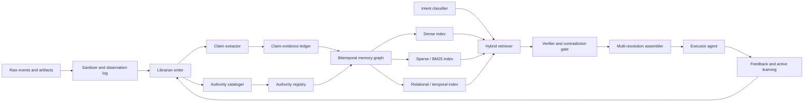

# Behavioral Memory Architecture

Summary: Orquesta Memory stores operational behavior change, not raw events or generic summaries.

## Core Model

Memory is a governance layer over future behavior. A durable memory is accepted only when it can improve a future agent's action, safety, speed, cost, abstention, or consistency.

The golden rule is:

```text
Do not store what happened.
Store what should change next time because it happened.
```

## Required Semantics

Every durable memory must include:

- `trigger`: when the memory becomes relevant.
- `behavior_delta`: what future agents should do differently.
- `evidence_refs`: why the memory is justified.

## AI/System Boundary

LLMs may propose meaning. Deterministic policy governs state.

LLMs may propose extraction, classification, summaries, topic keys, relation candidates, contradiction candidates, and retrieval intent. Deterministic code validates schemas, permissions, scope, lifecycle transitions, admission thresholds, durable writes, mutation, deletion, and final context injection.

## Memory Roles

The conceptual library roles are acquisition, cataloging, verification, conservation, reference, authority, and policy. Early versions may implement these as modules in one `agent-memory` service; later versions may split them into specialized workers or agents.

## Non-Goals

Memory is not chat history. Memory is not raw model output. Memory is not a vector store dump. Memory is not allowed to rewrite canonical project history without deterministic policy or human review.

## Why Behavioral, Not Archival

Agents exhibit experience-following: when they retrieve similar past experiences, they tend to repeat similar outputs. Stored raw, a single bad experience propagates as misaligned replay. Behavioral memory counters this by storing the corrected behavior delta and by allowing anti-memories to block a pattern rather than merely recall it.

## Cognitive-Architecture Framing

Classical cognitive architectures (e.g. Soar) separate semantic, episodic, and procedural memory and let activation by frequency and recency influence retrieval. Orquesta mirrors this: `claim`/`decision` are semantic, `observation` is episodic evidence, and `procedure` is procedural. The distinction matters because each is admitted, retrieved, and retired differently.

## Target Pipeline



This is the V10 target. Early versions implement subsets; the diagram orients all phases toward one architecture.

## Research Lineage

This documentation set absorbs the following prior art so the archived reports are not required reading:

- **Generative Agents** — observation / reflection / planning triad over a natural-language memory stream.
- **MemGPT** — OS-style tiered memory with movement between fast and slow context.
- **HippoRAG** — LLM + knowledge graph + Personalized PageRank for low-cost multi-hop.
- **A-MEM** — Zettelkasten-style linked notes that update historical representations.
- **MemoryOS / HiMem / All-Mem / LightMem** — explicit hierarchy and online/offline consolidation.
- **MIRIX** — multi-agent, multimodal memory with core/episodic/semantic/procedural/resource/knowledge-vault types.
- **Mem0** — scalable extraction, consolidation, retrieval with a graph variant.
- **Letta / MemFS** — always-visible core memory blocks; git-backed versioned memory with conflict resolution.
- **MemX** — local-first vector + keyword + RRF + rerank with low-confidence rejection.

The consistent lesson: structure, hierarchy, and consolidation beat plain top-k vector search when long-term stability matters.
